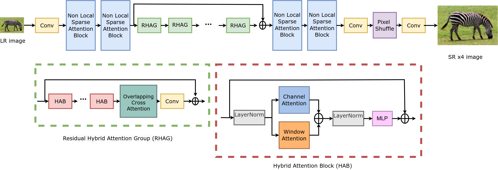
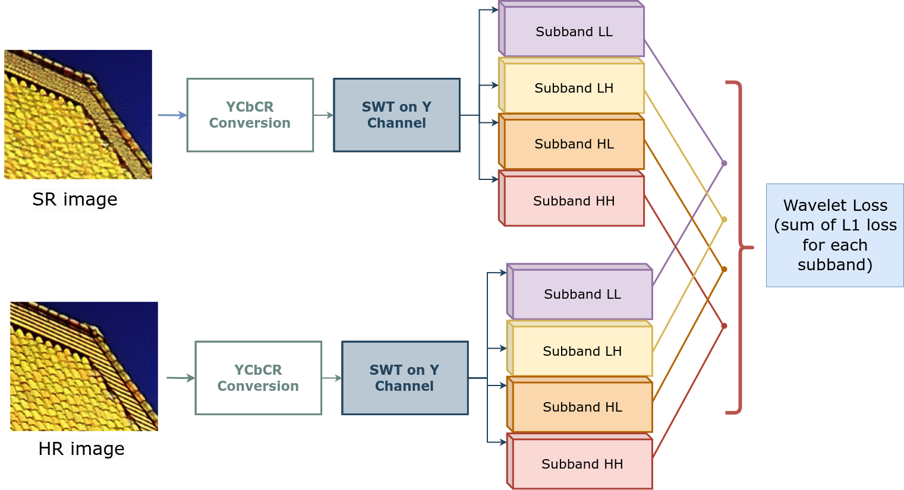
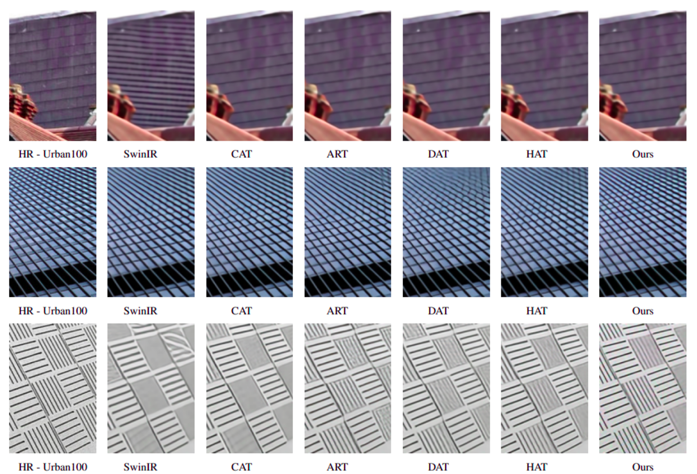

# Wavelettention
> in NTIRE 2024 

## [Training Transformer Models by Wavelet Losses Improves Quantitative and Visual Performance in Single Image Super-Resolution](https://arxiv.org/pdf/2404.11273.pdf)
[Cansu Korkmaz](https://mandalinadagi.github.io/) and [A. Murat Tekalp](http://mysite.ku.edu.tr/mtekalp/)

### Method:
<p align="center">
  
</p>

### Stationary Wavelet Loss Depiction:
<p align="left">
  
</p>

### Visual Comparisons:


Also to compare our method, you can download benchmark results from [Google Drive](https://drive.google.com/drive/folders/1siOshbeLHqkNPLUfloc7LpdIirOj7EHH?usp=drive_link)

### Getting Start

Create python virtual environment and install dependencies
```
- python -m venv wlt
- source source ./wlt/bin/activate
- pip install torch torchvision torchaudio --index-url https://download.pytorch.org/whl/cu118
- pip install -r requirements.txt
```
- clone this repository
```
git clone https://github.com/mandalinadagi/Wavelettention
cd Wavelettention
```

### How To Test
1. Download pretrained model from [Google Drive](https://drive.google.com/file/d/1iwktY-N4PYklzoQBLFk_SZ9pdhOkEGXv/view?usp=drive_link) and place it under `wavelettention/pretrained_models/`.
2. Prepare the datasets which can be downloaded from [Google Drive](https://drive.google.com/drive/folders/1pRmhEmmY-tPF7uH8DuVthfHoApZWJ1QU?usp=sharing).
3. Modify the configuration file `options/test_Wavelettention_SRx4.yml`. (path to datasets and the pretrained model)
4. Run the command `python wavelettention/test.py -opt options/test_Wavelettention_SRx4.yml`.
5. You can find the images in `results/test_wavelettention/visualization/` folder.

### How to Train
1. Download the [LSDIR dataset](https://data.vision.ee.ethz.ch/yawli/index.html).
2. Prepare the Imagenet pretrained x4 [HAT-L model](https://drive.google.com/file/d/1uefIctjoNE3Tg6GTzelesTTshVogQdUf/view?usp=drive_link).
3. Modify the configuration file `options/train_Wavelettention_SRx4.yml`. (path to datasets, pretrained model, set scaling of each wavelet loss term)
4. Run the command `CUDA_VISIBLE_DEVICES=0,1,2,3,4,5,6,7 python wavelettention/train.py -opt options/train_Wavelettention_SRx4.yml`.

### Citation
If you find our work helpful in your resarch, please consider citing the following paper.
```
@inproceedings{korkmaz2024wavelettention,
  title={Training Transformer Models by Wavelet Losses Improves Quantitative and Visual Performance in Single Image Super-Resolution},
  author={Korkmaz, Cansu and Tekalp, A. Murat},
  booktitle={Proceedings of the IEEE/CVF Conference on Computer Vision and Pattern Recognition (CVPR) Workshops},
  month={June},
  year={2024}
}
```

### Contact
If you have any questions please email at ckorkmaz14@ku.edu.tr


_Our code is built on [BasicSR](https://github.com/XPixelGroup/BasicSR) and [HAT](https://github.com/XPixelGroup/HAT). Thanks to their great work._

